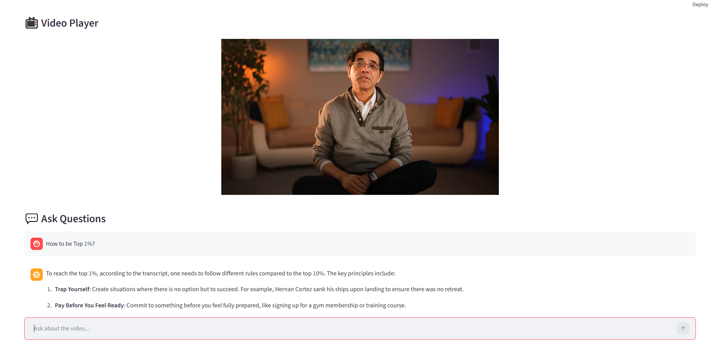

# 🎥 YouTube RAG Chat (Streamlit + LangChain + Ollama)

An interactive Streamlit application that allows users to:

- Load a YouTube video
- Automatically fetch its transcript
- Build a Retrieval-Augmented Generation (RAG) index
- Ask contextual questions about the video
- Get answers strictly grounded in transcript content

The video player remains visible while interacting with the chat interface.

---

## 🚀 Features

- ✅ YouTube transcript extraction
- ✅ Automatic chunking & vector indexing (FAISS)
- ✅ Local LLM support via Ollama (qwen2.5)
- ✅ Transcript-grounded answers only
- ✅ Persistent embedded video player
- ✅ Chat history support
- ✅ Clean Streamlit UI

---

## 🧠 Architecture Overview

1. User enters YouTube URL
2. App extracts video ID
3. Transcript is fetched via `youtube-transcript-api`
4. Transcript is split into chunks
5. Chunks embedded using `sentence-transformers`
6. FAISS vector store created
7. Retrieval pipeline built with LangChain
8. Questions are answered using RAG with Ollama

---

## 📦 Installation

### 1️⃣ Clone the repository

```bash
git clone <your-repo-url>
cd <your-folder>

